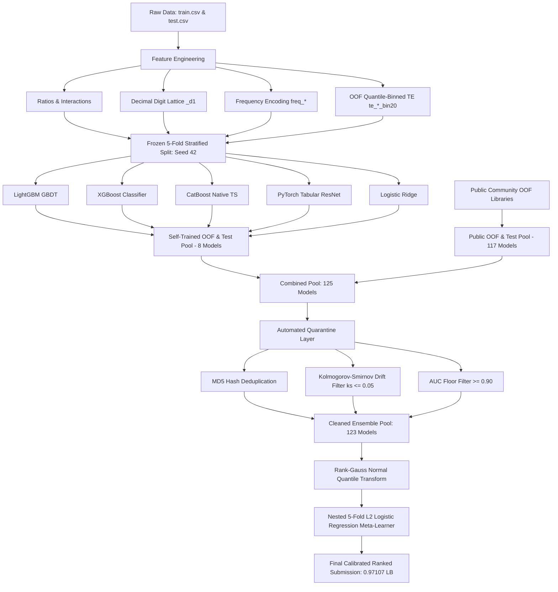

# Predicting Smartphone Addiction — Kaggle Playground Series (S6E8)

[](https://www.kaggle.com/competitions/playground-series-s6e8)
[-gold?logo=kaggle&logoColor=white)](https://www.kaggle.com/competitions/playground-series-s6e8/leaderboard)
[](#-evaluation-metric--format)
[](https://www.python.org/)

---

## 🏆 Highlights & Competition Results

An end-to-end multi-model stacking pipeline for predicting smartphone addiction using synthetic behavioral and usage telemetry. Combining **8 self-trained multi-architecture models** (LightGBM, XGBoost, CatBoost with native ordered target stats, Deep Tabular ResNet, and Logistic Ridge) with **117+ public community out-of-fold (OOF) models** through a **quarantine verification layer** and a **Rank-Gauss Nested L2 Logistic Regression meta-model**.

| Metric | Initial Baseline | Multi-Model Stack (Final) | Δ Gain |
| :--- | :--- | :--- | :--- |
| **Public Leaderboard (AUC)** | `0.96614` | **`0.97107`** | **`+0.00493`** |
| **Kaggle Rank** | Rank 1361 / 3343 | **Rank 420 / 3343 (Top 13%)** | **+941 ranks** |
| **Nested 5-Fold OOF AUC** | `0.964719` | **`0.969885`** | **`+0.005166`** |
| **Stacked Pool Members** | 8 models | **123 validated models** (125 pool - 2 quarantined) | +115 models |

---

## 📌 1. Competition Overview

- **Competition:** [Kaggle Playground Series - Season 6, Episode 8](https://www.kaggle.com/competitions/playground-series-s6e8)
- **Source Dataset:** [Smartphone Usage and Addiction Prediction Dataset](https://www.kaggle.com/datasets/jayjoshi37/smartphone-usage-and-addiction-prediction)
- **Problem Type:** Tabular Binary Classification
- **Target Variable:** `addicted_label` (`0` = Not Addicted, `1` = Addicted)
- **Evaluation Metric:** Area Under the ROC Curve (**ROC AUC**)
- **Data Volume:** 691,369 training rows, 296,302 test rows

---

## 🏗️ 2. Pipeline Architecture



---

## 💡 3. Key Strategies & Technical Insights

### 1. "Diversity Beats Strength"
- Stacking 100+ identical GBDT models quickly leads to diminishing returns.
- Combining fundamentally diverse architectures (**LightGBM**, **CatBoost**, **XGBoost**, **Deep Tabular ResNet**, and **Logistic Ridge**) with distinct inductive biases creates orthogonal error residuals that yield large meta-model gains (+0.0051 OOF).
- **"No target encoding" views** often receive the highest meta-model coefficients because standard target encoding collapses unique variance across trees.

### 2. Automated Quarantine Verification Layer
Blindly stacking all public arrays introduces severe risks (data leakage, duplicate weights, test drift). Before stacking, the pool passes through three quarantine checks:
1. **MD5 Hash Deduplication:** Eliminates exact duplicate models that artificially double-count weight.
2. **Kolmogorov-Smirnov (KS) Drift Filter:** Compares the rank distributions of OOF vs. Test predictions (`ks_2samp <= 0.05`). Outlier models showing high distribution shift (such as standard KNN and uncalibrated Random Forest) are automatically removed.
3. **AUC Floor & Corrector Preservation:** Removes degenerate predictions (AUC < 0.90) while preserving signed geometric corrector vectors (e.g., `*perp*`).

### 3. Rank-Gauss Normal Quantile Transform & Nested Stacking
- Predictions across 120+ base models span vastly different calibrations and score intervals.
- Applying a **Rank-Gauss transformation** (`norm.ppf((rank - 0.5) / N)`) normalizes all predictions onto standard Gaussian quantiles while strictly preserving rank ordering.
- A **nested 5-fold meta-learner** ensures zero in-sample leakage during cross-validation, with convergence assertions (`max(n_iter) < max_iter`) guaranteeing honest evaluation.

---

## 📊 4. Validation & Experimentation Results

### Base Model Cross-Validation Summary (5-Fold Stratified)

| Model Name | Feature View | OOF ROC AUC | Meta-Model Role / Insight |
| :--- | :--- | :--- | :--- |
| `xgb_no_te` | Tree Features (No TE) | **0.964335** | Strongest standalone single model |
| `xgb_te` | Tree Features (+ Binned TE) | 0.964030 | High-accuracy tree interaction learner |
| `lgbm_no_te` | Tree Features (No TE) | 0.963980 | Fast gradient boosting baseline |
| `lgbm_te` | Tree Features (+ Binned TE) | 0.963715 | Regularized leaf-wise tree learner |
| `cat_no_te` | Native Categorical Stats | 0.959177 | High diversity; high positive meta-weight |
| `cat_te` | Native Stats + TE | 0.959175 | Symmetric tree structure regularization |
| `resnet` | Deep Residual Network (88 feats) | 0.941568 | Orthogonal continuous-space representations |
| `logistic` | Standardized Linear Ridge | 0.924465 | Regularized linear baseline for disagreement |

### Ensemble Stacking Comparison

| Stacking Method | Pool Size | OOF ROC AUC | Public Leaderboard |
| :--- | :--- | :--- | :--- |
| Equal Rank Average (Baseline) | 123 models | `0.967884` | `~0.9691` |
| **Nested Rank-Gauss Meta-Model (Final)** | **123 models** | **`0.969885`** | **`0.97107` (Rank 420 / 3343)** |

---

## 🔬 5. Feature Engineering Blueprint

The pipeline builds **61 tree features** and **88 neural network features** from the raw 12 input features:

1. **Behavioral Ratios & Proportions:**
   - `screen_to_sleep_ratio`: $\text{daily\_screen\_time\_hours} / (\text{sleep\_hours} + \epsilon)$
   - `social_share_of_screen`: $\text{social\_media\_hours} / (\text{daily\_screen\_time\_hours} + \epsilon)$
   - `gaming_share_of_screen`: $\text{gaming\_hours} / (\text{daily\_screen\_time\_hours} + \epsilon)$
   - `productive_ratio`: $\text{work\_study\_hours} / (\text{daily\_screen\_time\_hours} + \epsilon)$
   - `weekend_to_weekday_ratio`: $\text{weekend\_screen\_time} / (\text{daily\_screen\_time\_hours} + \epsilon)$
   - `total_active_hours`: $\text{daily\_screen\_time} + \text{work\_study} + \text{sleep}$ (detecting synthetic edge cases)
2. **Frequency & Rate Metrics:**
   - `notifications_per_screen_hour`: $\text{notifications\_per\_day} / (\text{screen\_time} + \epsilon)$
   - `app_opens_per_screen_hour`: $\text{app\_opens\_per\_day} / (\text{screen\_time} + \epsilon)$
   - `notifications_per_open`: $\text{notifications\_per\_day} / (\text{app\_opens} + \epsilon)$
3. **Generator Fingerprinting (Decimal Lattice):**
   - Extracted first decimal digit (`_d1`) across continuous floats ($\lfloor \text{val} \times 10 + 10^{-6} \rfloor \pmod{10}$) to capture generator quantization patterns.
4. **Frequency Encoding (`freq_*`):**
   - Normalized frequency distributions computed per category and decimal digit level.
5. **OOF Quantile-Binned Target Encoding (`te_*_bin20`):**
   - Continuous numerical variables segmented into 20 quantile bins and target-encoded within out-of-fold splits with Laplace smoothing to prevent target leakage.

---

## 📁 6. Repository Structure

```text
Predicting-Smartphone-Addiction/
├── input/                                # Competition data & OOF libraries
│   ├── train.csv                         # 691,369 rows (44.9 MB)
│   ├── test.csv                          # 296,302 rows (18.6 MB)
│   ├── sample_submission.csv             # Target submission template
│   └── oof_libraries/                    # Downloaded community OOF prediction libraries
├── download_oof_libraries.py             # Automated Kaggle CLI OOF downloader
├── main.py                               # Complete training, feature engineering & stacking pipeline
├── submissions/                          # Generated submission files
│   └── submission.csv                    # Final ranked prediction submission (0.97107 LB)
├── requirements.txt                      # Project dependencies
└── README.md                             # Documentation
```

---

## 🚀 7. Quickstart & Reproducibility

### 1. Clone & Set Up Environment

```bash
# Clone the repository
git clone https://github.com/Maher-Amara/Predicting-Smartphone-Addiction.git
cd Predicting-Smartphone-Addiction

# Create and activate virtual environment
python -m venv .venv
# On Windows:
.venv\Scripts\activate
# On Linux/macOS:
source .venv/bin/activate

# Install dependencies
pip install -r requirements.txt
```

### 2. Download Public OOF Prediction Libraries

```bash
# Step 1: Authenticate Kaggle CLI (via browser or kaggle.json)
python -m kaggle auth login

# Step 2: Download and unpack verified public OOF libraries
python download_oof_libraries.py
```

### 3. Run the End-to-End Pipeline

```bash
python main.py
```

Execution will:
1. Load `train.csv` and `test.csv` without reordering.
2. Build 61+ engineered features (ratios, decimal lattice, frequency, and binned TE).
3. Train 8 base models across 5 stratified folds.
4. Load public OOF predictions and apply the 3-step quarantine filter.
5. Fit the nested Rank-Gauss L2 Logistic Regression meta-model.
6. Export the final submission to `submissions/submission.csv`.

---

## 📜 8. Acknowledgments & Citations

Special thanks to Kaggle community contributors for publishing OOF libraries and analytical notebooks on S6E8:
- **@szymonkapiski** for the 47-model OOF library and the core insight that *correlation matters more than strength*.
- **@boltuzamaki** for the high-diversity OOF prediction library.
- **@adarsh1077** for the *Diversity Beats Strength* analysis and leave-one-author-out study.
- **@dariushafshar** for the Kolmogorov-Smirnov drift filtering concept.
- **@tomasa2** for the generator fingerprinting and decimal lattice findings.
- **@najiama** for the ensemble blend benchmarks.

```bibtex
@misc{playground-series-s6e8,
    author = {Yao Yan, Walter Reade, Elizabeth Park},
    title = {Predicting Smartphone Addiction},
    publisher = {Kaggle},
    year = {2026},
    howpublished = {\url{https://kaggle.com/competitions/playground-series-s6e8}}
}
```
