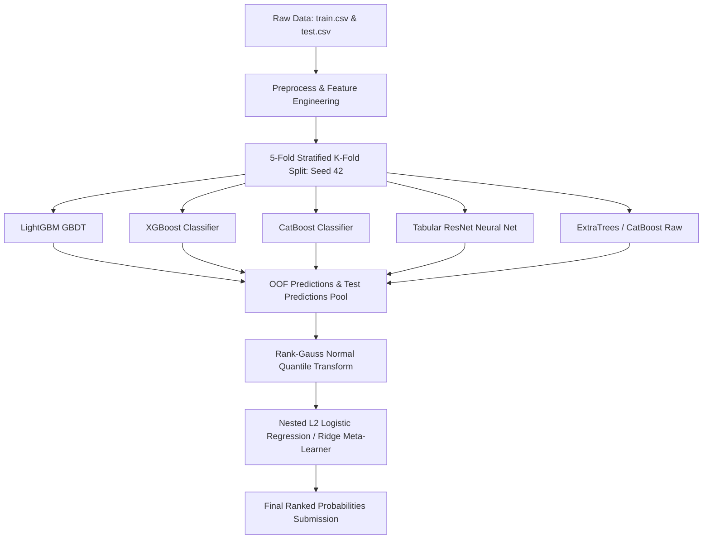

# Predicting Smartphone Addiction (Kaggle Playground Series - S6E8)

[](https://www.kaggle.com/competitions/playground-series-s6e8)
[](#evaluation-metric)
[](https://www.python.org/)
[](https://creativecommons.org/licenses/by/4.0/)

---

## 📌 1. Competition Overview

The **Playground Series Season 6 Episode 8 (S6E8)** challenge asks competitors to accurately predict smartphone addiction based on synthetic behavioral, demographic, and digital usage patterns generated from real-world research data.

- **Competition URL:** [Kaggle S6E8 Overview](https://www.kaggle.com/competitions/playground-series-s6e8)
- **Original Dataset Source:** [Smartphone Usage & Addiction Prediction Dataset](https://www.kaggle.com/datasets/jayjoshi37/smartphone-usage-and-addiction-prediction)
- **Problem Type:** Tabular Binary Classification
- **Target Feature:** `addicted_label` (`0` = Not Addicted, `1` = Addicted)
- **Timeline:** August 1, 2026 – August 31, 2026 (11:59 PM UTC)
- **Submissions Limit:** Maximum 10 submissions per day; 2 final selected submissions for Private LB evaluation.

---

## 📊 2. Dataset Anatomy & Summary Statistics

The synthetic dataset contains **~987,671 total samples** (~71.2 MB) split between training and testing partitions.

### Dataset Dimensions

| File | Rows | Columns | File Size | Description |
| :--- | :--- | :--- | :--- | :--- |
| `input/train.csv` | **691,369** | 14 | ~44.9 MB | Training set with ground truth `addicted_label` |
| `input/test.csv` | **296,302** | 13 | ~18.6 MB | Test set for evaluation (predict probability) |
| `input/sample_submission.csv` | **296,302** | 2 | ~7.7 MB | Expected submission format (`id`, `addicted_label`) |

### Target Distribution

- **Class `1` (Addicted):** `490,473` rows (**70.94%**)
- **Class `0` (Not Addicted):** `200,896` rows (**29.06%**)
- *Note:* The target exhibits moderate class imbalance; stratification during cross-validation is mandatory.

### Feature Dictionary & Missingness

| Feature | Data Type | Null Count (Train) | Null % (Train) | Null Count (Test) | Description / Range |
| :--- | :--- | :--- | :--- | :--- | :--- |
| `id` | Integer | 0 | 0.00% | 0 | Unique record identifier (Train: `0` to `691,368`, Test: `691,369` to `987,670`) |
| `age` | Float | 28,929 | 4.18% | 17,138 | Age of the individual (18 – 35 years, mean: ~26.6) |
| `daily_screen_time_hours` | Float | 95,854 | 13.86% | 32,788 | Total reported screen time per day (hours) |
| `social_media_hours` | Float | 133,995 | 19.38% | 47,397 | Hours spent on social media daily |
| `gaming_hours` | Float | 126,821 | 18.34% | 59,420 | Hours spent gaming on mobile daily |
| `work_study_hours` | Float | 51,518 | 7.45% | 27,777 | Daily hours dedicated to work/study |
| `sleep_hours` | Float | 44,480 | 6.43% | 22,455 | Average nightly sleep duration (hours) |
| `notifications_per_day` | Float | 67,584 | 9.78% | 34,221 | Approximate daily incoming notifications |
| `app_opens_per_day` | Float | 80,710 | 11.67% | 25,705 | Approximate number of app unlocks/launches per day |
| `weekend_screen_time` | Float | 112,063 | 16.21% | 50,697 | Screen time during weekend days (hours) |
| `gender` | Categorical | 29,034 | 4.20% | 14,212 | Categorical: `['Male', 'Female', 'Other', NaN]` |
| `stress_level` | Categorical | 55,148 | 7.98% | 19,626 | Ordinal/Categorical: `['Low', 'Medium', 'High', NaN]` |
| `academic_work_impact` | Categorical | 44,224 | 6.40% | 25,721 | Binary Categorical: `['No', 'Yes', NaN]` |
| `addicted_label` | Integer | 0 | 0.00% | *N/A* | Binary Target (`0` or `1`) |

---

## 🎯 3. Evaluation Metric & Format

Submissions are evaluated on **Area Under the ROC Curve (ROC AUC)** between the predicted probabilities and true binary labels.

### Key Mathematical Characteristics
- **Rank-invariant:** ROC AUC depends strictly on the relative ordering of predictions rather than calibration.
- **Percentile Ranking / Rank-Gauss:** Rank transformations preserve ROC AUC perfectly while regularizing extreme tails when ensembling.

### Submission File Format
```csv
id,addicted_label
691369,0.2015
691370,0.8542
691371,0.0411
...
```

---

## 🧠 4. Core Learnings & Lessons from Successful Notebooks

An in-depth analysis of high-performing community notebooks reveals vital architectural rules, feature patterns, and traps:

### 1. The Standard 5-Fold Split Convention
All major public out-of-fold (OOF) libraries strictly standardize on:
```python
from sklearn.model_selection import StratifiedKFold

skf = StratifiedKFold(n_splits=5, shuffle=True, random_state=42)
splits = list(skf.split(train_df, train_df['addicted_label']))
```
> ⚠️ **CRITICAL:** Do NOT sort or reindex `train.csv` before splitting! Most community `.npy` OOF arrays are positional. Row order must remain identical to the original raw file.

### 2. "Diversity Beats Strength"
- Stacking 100+ highly correlated LightGBM/XGBoost models hits diminishing returns rapidly.
- Combining fundamentally different model families (**LightGBM**, **CatBoost**, **XGBoost**, **Tabular ResNet / MLP**, **KNN**, and **Logistic Ridge**) yields consistent OOF gains (+0.00030 to +0.00050).
- Lower-accuracy standalone models (e.g. ResNet with 0.9408 AUC) are highly valuable in meta-models because they produce orthogonal error residuals.

### 3. The 0.97110+ Overfitting Trap (Public LB vs Private Reality)
- **Public LB Size:** The Public test leaderboard consists of only **20%** (~59,260 rows) of the test dataset.
- **Noise Exploitation:** At Public LB > `0.97110`, leaderboard gains frequently come from reverse micro-sorting, subtracting weak students, or fitting noise artifacts specific to the 20% slice.
- **Historical Season 6 Precedents:** In S6E2, S6E6, and S6E7, 0% of the Public Top 10 remained in the Private Top 10 due to Public LB overfitting.
- **Theoretical Limit:** Calibrated Bayes optimal ceiling for this synthetic dataset is approximately **~0.9701 to 0.9705 Out-of-Fold**, which lifts to **~0.9711 to 0.9713 on LB** solely due to test-fold ensembling (5-model averaging effect).

### 4. Meta-Model Best Practices
- **Rank-Gauss Transformation:** Rank-transforming predictions into normal quantiles before passing them to an L2 Logistic Regression meta-model beats raw logit averaging by `+0.00008` AUC.
- **Nested Fitting:** Meta-models must be fit in a strictly nested fold structure to ensure no meta-learner sees out-of-fold rows it was trained on.

---

## 💡 5. Feature Engineering Blueprint

High-impact engineered features tailored to smartphone usage behaviors:

### A. Ratios & Proportions
- `screen_to_sleep_ratio`: `daily_screen_time_hours / (sleep_hours + 1e-4)`
- `social_share_of_screen`: `social_media_hours / (daily_screen_time_hours + 1e-4)`
- `gaming_share_of_screen`: `gaming_hours / (daily_screen_time_hours + 1e-4)`
- `productive_ratio`: `work_study_hours / (daily_screen_time_hours + 1e-4)`
- `weekend_to_weekday_ratio`: `weekend_screen_time / (daily_screen_time_hours + 1e-4)`

### B. Interaction & Frequency Metrics
- `notifications_per_screen_hour`: `notifications_per_day / (daily_screen_time_hours + 1e-4)`
- `app_opens_per_screen_hour`: `app_opens_per_day / (daily_screen_time_hours + 1e-4)`
- `notifications_per_open`: `notifications_per_day / (app_opens_per_day + 1e-4)`
- `total_active_hours`: `daily_screen_time_hours + work_study_hours + sleep_hours` (identifying >24h impossible totals)

### C. Missingness Profiling
- `missing_feature_count`: Count of `NaN` values across row features.
- Missingness indicator flags (`is_missing_daily_screen_time`, `is_missing_gaming_hours`, etc.).

### D. Group Aggregations & Target Encoding
- Aggregated screen/sleep statistics grouped by `['age', 'stress_level']` or `['gender', 'academic_work_impact']`.
- Out-of-fold target encoding for categorical features with smoothing.

---

## 🏗️ 6. Modeling Strategy & Architecture



### Level 1: Diverse Base Models
1. **LightGBM:** Fast gradient boosting on binned numerical features and categorical data.
2. **XGBoost:** Histogram-based tree learning with depth-wise and leaf-wise regularization.
3. **CatBoost:** Native categorical support, symmetric trees preventing high-cardinality overfitting.
4. **Tabular ResNet (PyTorch):** Multi-layer residual blocks with `BatchNorm1d`, `Dropout(0.2-0.3)`, and `ReLU` skip connections.
5. **Distance / Linear Models:** Regularized Logistic Regression and Scaled KNN for disagreement diversity.

### Level 2: Ensembling & Stacking
1. **Rank Transformation:** Standardize all model outputs using `scipy.stats.rankdata(pred) / len(pred)`.
2. **Meta-Learners:** Fit nested Ridge/Logistic Regression models on Rank-Gauss transformed features.
3. **Optimization:** Apply Nelder-Mead / Scipy `minimize` on OOF ROC AUC with Dirichlet weight constraints.

---

## 📁 7. Repository Organization

```text
Predicting-Smartphone-Addiction/
├── input/                                # Raw competition data
│   ├── train.csv                         # 691,369 rows
│   ├── test.csv                          # 296,302 rows
│   └── sample_submission.csv             # Template submission file
├── examples/                             # Top reference community notebooks
│   ├── nomobilephone-nomophobia-optuna-xgb.ipynb
│   ├── predicting-smartphone-addict-nn-residual-network.ipynb
│   ├── s6e8-addiction-lb-0-97113.ipynb
│   ├── s6e8-diversity-beats-strength.ipynb
│   ├── why-every-s6e8-notebook-above-0-97110-overfits.ipynb
│   └── overfitting-trap-do-not-copy.ipynb
├── src/                                  # Modular source code
│   ├── data/                             # Data loading and split management
│   ├── features/                         # Feature engineering transformations
│   ├── models/                           # GBDT, PyTorch ResNet, and baseline trainers
│   └── ensemble/                         # Stacking, rank averaging, and calibration
├── notebooks/                            # Exploratory and experimental notebooks
├── submissions/                          # Generated submission files
├── requirements.txt                      # Dependencies & package versions
└── README.md                             # Project documentation
```

---

## 🚀 8. Quickstart & Workflow Guide

### 1. Environment Setup
```bash
# Clone the repository
git clone https://github.com/Maher-Amara/Predicting-Smartphone-Addiction.git
cd Predicting-Smartphone-Addiction

# Create virtual environment
python -m venv venv
# On Windows:
.\venv\Scripts\activate

# Install dependencies
pip install -r requirements.txt
```

### 2. Standard Dependencies
```text
numpy>=1.24.0
pandas>=2.0.0
scikit-learn>=1.3.0
lightgbm>=4.1.0
xgboost>=2.0.0
catboost>=1.2.0
torch>=2.1.0
optuna>=3.4.0
scipy>=1.11.0
```

### 3. Golden Rules for Validation
1. **Never trust single-fold or random train/test splits.** Always use frozen 5-Fold Stratified K-Fold.
2. **Never optimize directly against the Public Leaderboard score.** If a change improves Public LB by `0.00002` but degrades 5-fold CV, **reject it**.
3. **Always submit rank-averaged or calibrated ensemble probabilities.**

---

## 🏆 9. Competition Checklist & Milestones

- [x] Download dataset and verify row/column schema integrity.
- [x] Analyze community winning patterns and document overfitting pitfalls.
- [x] Establish locked 5-fold Stratified CV pipeline (`seed=42`).
- [ ] Build baseline LightGBM / XGBoost / CatBoost pipelines.
- [ ] Implement feature engineering (ratios, missingness indicators, interactions).
- [ ] Train PyTorch Tabular ResNet to inject neural network diversity.
- [ ] Implement Rank-Gauss + Nested Logistic Regression meta-model stacker.
- [ ] Generate submission files and select final 2 candidate models for Private LB.

---

## 📜 10. Citation & Acknowledgments

```bibtex
@misc{playground-series-s6e8,
    author = {Yao Yan, Walter Reade, Elizabeth Park},
    title = {Predicting Smartphone Addiction},
    publisher = {Kaggle},
    year = {2026},
    howpublished = {\url{https://kaggle.com/competitions/playground-series-s6e8}}
}
```
Special thanks to Kaggle community contributors for sharing OOF libraries, distillation insights, and cautionary analysis on leaderboard dynamics.
